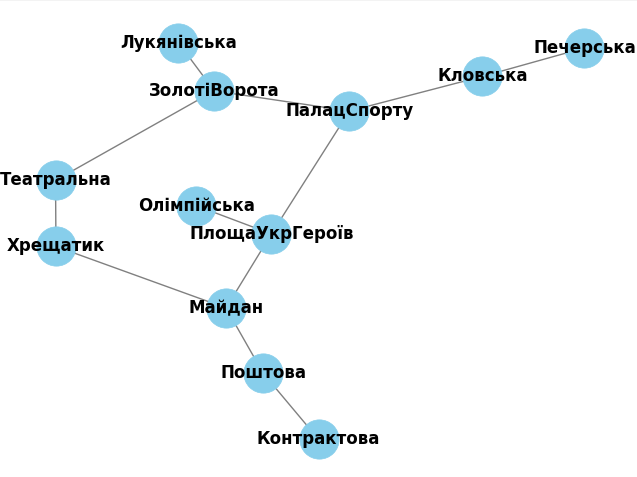

# Завдання 1:
Побудований граф шляхопроводів станцій київського метрополітену

кількість вершин 12
кількість ребер 12
Degree of each station:
Лукянівська: 1
ЗолотіВорота: 3
Театральна: 2
Контрактова: 1
Поштова: 2
Майдан: 3
Хрещатик: 2
ПлощаУкрГероїв: 3
ПалацСпорту: 3
Кловська: 2
Печерська: 1
Олімпійська: 1

# Завдання 2:

### DFS Path:
['Лукянівська', 'ЗолотіВорота', 'ПалацСпорту', 'ПлощаУкрГероїв', 'Олімпійська']
### BFS Path:
['Лукянівська', 'ЗолотіВорота', 'ПалацСпорту', 'ПлощаУкрГероїв', 'Олімпійська']

### Пояснення
Алгоритм DFS проходить якомога глибше вздовж кожної гілки. У цьому випадку він спочатку досліджував гілку, яка містить «Площу Українських Героїв», перш ніж досягти «Олімпійської».

Алгоритм BFS, з іншого боку, досліджує всіх сусідів вузла перед переходом до наступного рівня вузлів. У результаті він знайшов шлях, який включає «Палац Спорту» до «Олімпійської».

Основна відмінність полягає в порядку дослідження. DFS досліджує одну гілку в глибину перед переходом до іншої, а BFS досліджує всі гілки на поточному рівні перед переходом на наступний рівень.
Підсумовуючи, відмінності в отриманих шляхах зумовлені стратегіями дослідження DFS і BFS, а також структурою самого графіка. Кожен алгоритм може знайти дійсний шлях, але порядок дослідження може відрізнятися.

# Завдання 3:
Коротший шлях з Лукянівська до Олімпійська: ['Лукянівська', 'ЗолотіВорота', 'ПалацСпорту', 'ПлощаУкрГероїв', 'Олімпійська']
Корортша дистанція: 12